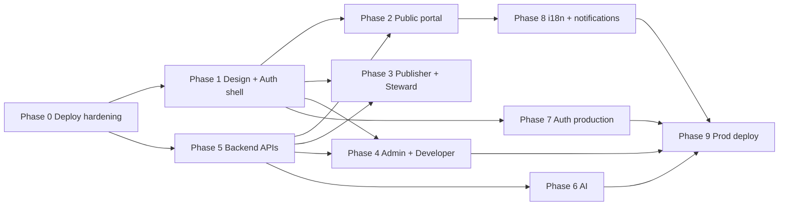

# OpenCivic — Current Status and Next Steps

> **Guideline for autonomous execution:** Use this document as the source of truth for what is built, what is not, and the phased plan. Every phase ends with agent-run gates (pytest, verify_release, E2E, deploy) — no user verification steps.

---

## Live progress (last updated: 2026-06-11, iteration 56)

### Delivery model (ADR-004)

| Track | Estimate | Notes |
|-------|----------|-------|
| **Platform v1** | **~99%** | OData entity set + `$count`; connector sync history; notification SSE |
| **UI Tier 1** | **~88%** | Jobs queue sparklines; live notification SSE badge |
| **UI Tier 2 (golden paths)** | **~79%** | Dev explorer OData tab; dataset connector chip |
| **Production readiness** | **~86%** | CI `--cov-fail-under=80` maintained |

### Sprint retrospective (iteration 56)

**Platform**
- **WS1 OData entity set:** `GET /datasets/{id}/odata/{entity_set}` JSON collection + `/$count` with `$top`/`$skip`.
- **WS2 Connector sync history:** `GET /connectors/{id}/sync-history` derived from connector timestamps/status.
- **WS3 Notification SSE:** `GET /notifications/stream` heartbeats with unread count payload.
- **WS4 Queue trends:** `depth_trend` stub array on each queue in `/admin/jobs/summary`.
- **WS5 Dataset connector:** `GET /datasets/{id}/connector` public sync metadata for linked connectors.

**UI parity**
- Developer console — OpenAPI/OData tabs with Power Query M on dataset-scoped explorer
- Dataset page — connector status chip (name, last sync, refresh frequency)
- Admin jobs — per-queue depth sparklines from API trend stub
- Notification bell — fetch-based SSE with auto-reconnect

**Start next (iteration 57)**

*Platform:*
- OData `$filter` query stub validation
- Connector sync history from event store (replace stub)
- Valkey-backed queue depth history rollups

*UI parity:*
- Admin connector sync history drawer
- Steward drawer connector lineage highlight
- Publisher dashboard connector health summary card

---

## Live progress (last updated: 2026-06-11, iteration 55)

### Delivery model (ADR-004)

| Track | Estimate | Notes |
|-------|----------|-------|
| **Platform v1** | **~99%** | OData `$metadata` XML; Flower→Valkey queue fallback; SCIM HMAC |
| **UI Tier 1** | **~87%** | Admin connector last-sync column |
| **UI Tier 2 (golden paths)** | **~76%** | Steward drawer; OData Power Query M snippet |
| **Production readiness** | **~85%** | CI `--cov-fail-under=80` maintained |

### Sprint retrospective (iteration 55)

**Platform**
- **WS1 OData metadata:** `GET /datasets/{id}/odata/$metadata` returns minimal CSDL XML from schema snapshot.
- **WS2 Queue fallback chain:** `celery_queue_service.py` prefers Flower `/api/queues/length`, falls back to Valkey `LLEN`, then placeholder.
- **WS3 SCIM HMAC:** `verify_scim_webhook_request()` accepts `X-SCIM-Token` or `X-SCIM-Signature` (HMAC-SHA256 over raw body).

**UI parity**
- Steward review — slide-over submission detail drawer (preview, lineage, embargo, review actions)
- Dataset API explorer — OData tab adds `$metadata` URL + Power Query M snippet for Excel
- Admin connectors — `last_sync_at` column with localized “never synced” fallback

**Start next (iteration 56)**

*Platform:*
- OData `$count` / entity set JSON stub
- Connector sync history endpoint (`last_sync_at` audit trail)
- Notification SSE heartbeat / reconnect polish

*UI parity:*
- Developer explorer OData tab parity with dataset page
- Publisher connector status chip on dataset detail
- Admin jobs per-queue sparkline or trend stub

---

## Live progress (last updated: 2026-06-11, iteration 54)

### Delivery model (ADR-004)

| Track | Estimate | Notes |
|-------|----------|-------|
| **Platform v1** | **~99%** | Valkey queue depths + Flower workers; PDF export; OData stub |
| **UI Tier 1** | **~85%** | Connector sync trigger i18n; jobs worker count |
| **UI Tier 2 (golden paths)** | **~72%** | OData tab; steward queue CSV + governance PDF |
| **Production readiness** | **~84%** | CI `--cov-fail-under=80` maintained |

### Sprint retrospective (iteration 54)

**Platform**
- **WS1 Queue depths:** `celery_queue_service.py` reads Valkey `LLEN` per queue; optional Flower `/api/workers` count.
- **WS2 Governance PDF:** `?format=pdf` on `/workflow/governance/export` returns base64 minimal PDF stub.
- **WS3 MFA polish:** `/auth/mfa/status` adds `provider`, `keycloak_enabled`, `enrollment_required`.
- **WS4 OData stub:** `GET /datasets/{id}/odata` service root metadata for published datasets.
- **WS5 Queue export:** `GET /workflow/queue/export` per-submission CSV stub.

**UI parity**
- Dataset API explorer — OData tab with service root + Excel/Power BI example snippet
- Steward review — queue CSV export + governance PDF download buttons
- Admin connectors — prominent “Trigger sync” with i18n feedback messages
- Admin jobs — displays `worker_count` and live queue depths from API

**Start next (iteration 55)**

*Platform:*
- OData `$metadata` XML stub endpoint
- Flower queue depth via broker inspect (fallback chain)
- SCIM webhook HMAC validation polish

*UI parity:*
- Steward submission detail drawer
- Dataset OData tab Power Query M snippet
- Admin connector last-sync timestamp column

---

## Live progress (last updated: 2026-06-11, iteration 53)

### Delivery model (ADR-004)

| Track | Estimate | Notes |
|-------|----------|-------|
| **Platform v1** | **~99%** | Logout unregisters Keycloak index; jobs summary API; governance date filter |
| **UI Tier 1** | **~82%** | Admin jobs panel wired to API; publisher staleness banner |
| **UI Tier 2 (golden paths)** | **~65%** | Dataset-scoped developer explorer; export date range |
| **Production readiness** | **~82%** | CI `--cov-fail-under=80` |

### Sprint retrospective (iteration 53)

**Platform**
- **WS1 Keycloak logout:** `unregister_keycloak_refresh` on OIDC logout; test in `test_keycloak_session_index.py`.
- **WS2 Jobs summary:** `GET /admin/jobs/summary` queue depth placeholders; tests in `test_admin_jobs_summary.py`.
- **WS3 Governance filter:** `?days=7|30|90` on summary/export endpoints; `report_days` in CSV.
- **WS4 CI coverage:** `--cov-fail-under=80`.

**UI parity**
- Developer console — dataset-scoped OpenAPI explorer (`/developer/explorer?dataset=…`)
- Dataset page — link to developer console from API explorer tab
- Steward export — date-range selector (7 / 30 / 90 days)
- Publisher dashboard — `PublisherStalenessBanner` for stale/outdated datasets
- Admin jobs — live queue depths from API stub (placeholder zeros)

**Start next (iteration 54)**

*Platform:*
- Wire Flower queue depths into `/admin/jobs/summary`
- Governance export PDF stub (alongside CSV)
- MFA status endpoint polish for pilot Keycloak

*UI parity:*
- Steward review queue CSV export (per-submission stub)
- Dataset page OData tab snippet
- IT admin connector sync trigger button

---

## Live progress (last updated: 2026-06-11, iteration 52)

### Delivery model (ADR-004)

| Track | Estimate | Notes |
|-------|----------|-------|
| **Platform v1** | **~99%** | Keycloak session index; governance CSV export; rollup worker test |
| **UI Tier 1** | **~78%** | Admin jobs panel with queue layout primitives |
| **UI Tier 2 (golden paths)** | **~58%** | Dataset API explorer tab; steward governance export |
| **Production readiness** | **~80%** | CI `--cov-fail-under=75` |

### Sprint retrospective (iteration 52)

**Platform**
- **WS1 Keycloak sessions:** `keycloak_session_index.py` registers refresh tokens on OIDC callback; SCIM suspend revokes indexed Keycloak tokens; tests in `test_keycloak_session_index.py`.
- **WS2 Rollup worker:** `test_rollup_usage_events_worker.py` exercises `rollup_usage_events` Celery task.
- **WS3 Governance export:** `GET /workflow/governance/export` CSV stub; tests in `test_governance_export.py`.
- **WS4 CI coverage:** `--cov-fail-under=75`.

**UI parity**
- Steward review — `StewardGovernanceExport` CSV download button
- Dataset page — `DatasetApiExplorer` (REST snippets + OpenAPI spec tab) for published datasets
- Admin jobs — `AdminJobsPanel` with `PageHeader`/`StatGrid` + six queue tiers + Flower iframe

**Start next (iteration 53)**

*Platform:*
- OIDC logout unregisters Keycloak refresh index entry
- Admin jobs summary API stub (queue depth placeholders)
- Coverage gate 80%

*UI parity:*
- Developer dataset-scoped OpenAPI explorer (link from dataset API tab)
- Steward governance export date-range filter stub
- Publisher dataset staleness alert banner

---

## Live progress (last updated: 2026-06-11, iteration 51)

### Delivery model (ADR-004)

| Track | Estimate | Notes |
|-------|----------|-------|
| **Platform v1** | **~98%** | SCIM session revoke; embargo auto-publish test; trend API |
| **UI Tier 1** | **~75%** | Publisher workflow timeline on dashboard |
| **UI Tier 2 (golden paths)** | **~52%** | Cmd+K tier labels; dataset engagement sparkline |
| **Production readiness** | **~78%** | CI `--cov-fail-under=70` |

### Sprint retrospective (iteration 51)

**Platform**
- **WS1 Session revoke:** `RefreshService.revoke_user_sessions` on SCIM suspend; tests in `test_scim_session_revoke.py`.
- **WS2 Embargo beat:** `test_embargo_auto_publish.py` for `check_embargo_releases`.
- **WS3 Analytics:** `GET /analytics/datasets/{id}/trend` for sparklines; `GET /workflow/publisher/timeline`.
- **WS4 CI coverage:** `--cov-fail-under=70`.

**UI parity**
- Command palette — keyword vs semantic tier badges (`exactMatch` / `related`)
- Publisher dashboard — `PublisherWorkflowTimeline` from CQRS events
- Dataset page — `DatasetStatsSparkline` (14-day views + downloads)

**Start next (iteration 52)**

*Platform:*
- Keycloak refresh-token path session index (pilot mode)
- Usage hourly rollup worker test
- Coverage gate 75%

*UI parity:*
- Steward governance report export stub
- Dataset page API explorer tab
- Admin jobs queue layout primitives

---

## Live progress (last updated: 2026-06-11, iteration 50)

### Delivery model (ADR-004)

| Track | Estimate | Notes |
|-------|----------|-------|
| **Platform v1** | **~97%** | SCIM webhook + API key revoke; Qdrant capability flag; circuit breaker tests |
| **UI Tier 1** | **~72%** | Developer rate limits panel with tenant plan gauge |
| **UI Tier 2 (golden paths)** | **~45%** | Dataset embed snippets; semantic search banner; SLA breach styling |
| **Production readiness** | **~76%** | CI `--cov-fail-under=65` |

### Sprint retrospective (iteration 50)

**Platform**
- **WS1 SCIM:** `/scim/webhook` for IdP delete events; suspend revokes API keys; tests in `test_scim_webhook.py`.
- **WS2 Qdrant flag:** `GET /portal/capabilities` + `semantic_search_degraded` in search meta.
- **WS3 Circuit breaker:** `test_connector_circuit_breaker.py` integration tests.
- **WS4 CI coverage:** `--cov-fail-under=65`.

**UI parity**
- Catalog — `SemanticSearchBanner` when Qdrant degraded
- Dataset — `DatasetEmbedPanel` (iframe preview + copy snippets) for published datasets
- Steward — SLA breach ring/pulse + urgent warning state on review cards
- Developer — `DeveloperRateLimitsPanel` with tenant plan limit `StatGrid`

**Start next (iteration 51)**

*Platform:*
- Session/token blocklist on SCIM suspend (Valkey family revoke)
- Embargo auto-publish Celery beat E2E test
- Coverage gate 70%

*UI parity:*
- Command palette semantic tier labels
- Publisher workflow timeline component
- Public dataset stats sparkline

---

## Live progress (last updated: 2026-06-11, iteration 49)

### Delivery model (ADR-004)

| Track | Estimate | Notes |
|-------|----------|-------|
| **Platform v1** | **~96%** | `platform.plans` seed; plan-linked tenant rate limits; pilot Keycloak login E2E |
| **UI Tier 1** | **~68%** | Admin health `PageHeader` + `StatGrid` |
| **UI Tier 2 (golden paths)** | **~38%** | Featured catalog strip; download format picker; search i18n + clear |
| **Production readiness** | **~74%** | CI `--cov-fail-under=60` |

### Sprint retrospective (iteration 49)

**Platform**
- **WS1 Plan seed:** `plan_seed_service.py` — Standard / Professional / Enterprise rows; called from `seed_dev.py` and tenant provisioning.
- **WS2 Plan-linked limits:** `hydrate_tenant_rate_limit` reads `platform.plans`; tests for plan row lookup.
- **WS3 Pilot auth E2E:** Playwright full Keycloak login → publisher dashboard (`OPENCIVIC_PILOT_AUTH=true`).
- **WS4 CI coverage:** `--cov-fail-under=60`.

**UI parity**
- Catalog — `CatalogFeaturedStrip` (quality-sorted), `CatalogSearch` i18n + clear
- Dataset download — format picker, presigned Parquet flow, `getAccessToken()`, i18n
- Admin health — `AdminHealthPanel` with layout primitives

**Start next (iteration 50)**

*Platform:*
- SCIM webhook skeleton + user suspend on delete event
- Qdrant graceful degradation banner API flag
- Coverage gate 65–70%; connector circuit breaker integration test

*UI parity:*
- Dataset page embed widget snippet UI
- Steward SLA timer visual polish (breach highlighting)
- Developer rate-limit gauges from tenant plan

---

## Live progress (last updated: 2026-06-11, iteration 48)

### Delivery model (ADR-004)

| Track | Estimate | Notes |
|-------|----------|-------|
| **Platform v1** | **~95%** | Tenant rate limit hydration; OIDC callback test + role routing |
| **UI Tier 1** | **~65%** | Admin connectors `StatGrid`; dataset preview i18n |
| **UI Tier 2 (golden paths)** | **~30%** | Public homepage with trust signals + published count |
| **Production readiness** | **~72%** | CI `--cov-fail-under=55` (path to 80%) |

### Sprint retrospective (iteration 48)

**Platform**
- **WS1 Tenant rate limits:** `tenant_rate_limit_service.py` hydrates Valkey on provision + `seed_dev.py`.
- **WS2 OIDC E2E:** Backend `test_oidc_callback_exchanges_code_for_tokens`; Playwright `oidc-callback.spec.ts`; callback routes to role dashboard via `staffDestinationForRole`.
- **WS3 CI coverage:** `--cov-fail-under=55` in `.github/workflows/ci.yml` (incremental gate toward 80%).

**UI parity**
- Public `/` homepage — `PublicHomeHero` with `StatGrid`, trust badges, browse CTA
- Dataset preview — `DatasetPreviewSection` with i18n
- Admin connectors — `AdminConnectorsPanel` with `PageHeader` + `StatGrid` + `EmptyState`

**Start next (iteration 49)**

*Platform:*
- Keycloak pilot: live login with test realm user (Playwright against real Keycloak)
- Tenant plan rows seeded in platform schema + plan-linked limits
- Raise coverage gate toward 65–70%

*UI parity:*
- Catalog Tier 2: featured datasets strip, search polish
- Dataset download UX polish (format picker, pre-signed progress)
- IT admin health deep view → layout primitives

---

## Live progress (last updated: 2026-06-11, iteration 47)

### Delivery model (ADR-004)

**Hybrid rule:** every iteration ships **one platform workstream** + **one UI parity slice** (see `docs/adr/004-ui-platform-parity.md`).

| Track | Estimate | Notes |
|-------|----------|-------|
| **Platform v1** | **~94%** | Edge rate limits + API key Valkey cache at gateway |
| **UI Tier 1** | **~58%** | Steward/publish/developer + dataset header on layout primitives |
| **UI Tier 2 (golden paths)** | **~22%** | Catalog `EmptyState`, dataset `PageHeader` + `StatGrid` |
| **Production readiness** | **~70%** | pgBackRest seed in `deploy.sh pilot` |

### Sprint retrospective (iteration 47)

**Platform**
- **WS1 Edge rate limits:** `edge_rate_limit.py` — per API key / tenant / user buckets in Valkey; enforced in `evaluate_gateway_auth` (429 at APISIX forward-auth) and `EdgeRateLimitMiddleware`.
- **WS2 API key cache:** `api_key_cache.py` — 5-minute Valkey cache on gateway validation; invalidated on revoke.
- **WS3 pgBackRest seed:** `./deploy.sh pilot up` runs stanza-create + full backup when `PGBACKREST_ENABLED=true`.

**UI parity (Tier 1 + Tier 2 slice)**
- Steward review → `PageHeader` + `StatGrid` + `EmptyState`
- Publish form → `PageHeader`
- Developer overview → `PageHeader` + `StatGrid`
- Catalog empty state → `EmptyState`
- Dataset detail → `DatasetDetailHeader` with i18n stats (`dataset.*` in en/ar/fr/es/zh)

**Start next (iteration 48)**

*Platform:*
- Full Keycloak browser login → dashboard E2E (token exchange)
- Tenant plan rate limit hydration into Valkey on provision
- 80% coverage CI gate (baseline measurement first)

*UI parity:*
- Dataset preview section i18n + loading skeleton
- Public homepage / trust signals (Tier 2 catalog polish)
- Admin connectors matrix → `StatGrid`

---

## Live progress (last updated: 2026-06-11, iteration 46 + hybrid UI foundation)

### Delivery model (ADR-004)

**Hybrid rule:** every iteration ships **one platform workstream** + **one UI parity slice** (see `docs/adr/004-ui-platform-parity.md`).

| Track | Estimate | Notes |
|-------|----------|-------|
| **Platform v1** | **~93%** | API, workers, gateway, auth — pytest-backed |
| **UI Tier 1** | **~45%** | `AppShell` + layout primitives on staff routes |
| **UI Tier 2 (golden paths)** | **~15%** | catalog → dataset → download still thin |
| **Production readiness** | **~68%** | pilot overlays, not full HA cluster |

Do not blend platform % and UI % into a single headline figure.

### Phase completion

| Phase | Status | Gate evidence |
|-------|--------|---------------|
| **Phase 0–2** | ✅ **Complete** | Cmd+K palette, catalog, lineage |
| **Phase 3 — Publisher + steward** | ✅ **~99% complete** | Publisher feedback panel i18n |
| **Phase 4 — IT admin + developer** | ✅ **~98% complete** | Admin branding UI |
| **Phase 5 — Backend completeness** | 🟡 **~98% complete** | Live TUS+Minio ingest test |
| **Phase 6 — AI** | 🟡 **~70% complete** | Chat UI confidence/citation polish |
| **Phase 7 — Auth** | 🟡 **~78% complete** | APISIX forward-auth + trusted headers |
| **Phase 8 — i18n + notifications** | 🟡 **~88% complete** | Branding i18n + public header tokens |
| **Phase 9 — Deploy** | 🟡 **~65% complete** | pgBackRest live test + PR gateway CI |
| Phases 10 | 🔲 Not started | — |

### Verified stack

```
Backend:    139 pytest passed, 14 skipped (live/gateway/pilot)
Smoke:      release_verify_ok · gateway_verify_ok · helm_smoke_ok
Frontend:   npm run build OK · Playwright 10/10 E2E (branding test)
CI:         nightly.yml · PR gateway job · helm pgbackrest ConfigMap
Gateway:    forward-auth → trusted headers → FastAPI (EDGE_AUTH_ENABLED)
Pilot:      ./deploy.sh pilot up (Keycloak + TUS overlay)
```

### Sprint retrospective (iteration 46)

**What went well**
- **WS1 Edge auth:** APISIX `forward-auth` → `/internal/gateway-auth`; JWT + API key validation; `EDGE_AUTH_ENABLED` trusted headers in FastAPI.
- **WS2 Keycloak E2E:** Pilot Playwright test navigates to Keycloak authorization URL.
- **WS3 pgBackRest:** `test_pgbackrest_live.py` gated on `PGBACKREST_ENABLED`.
- **WS4 CI:** `gateway` job in `.github/workflows/ci.yml` runs gateway pytest against compose stack.
- **WS5 Gates:** `verify_release.py` gateway auth smoke; 139 pytest passed.

**Gate:** 139 pytest · 14 skipped · release_verify_ok · gateway_verify_ok · helm_smoke_ok.

**Start next (iteration 47)**

*Platform (70%):*
- Per-tenant APISIX rate limits keyed by API key / tenant
- Valkey-backed API key cache at edge
- Full Keycloak browser login → dashboard E2E (token exchange)
- pgBackRest backup seed automation in `deploy.sh pilot`
- 80% coverage gate in CI

*UI parity (30%) — Tier 1:*
- Migrate steward review intro + publish form to `PageHeader` / `EmptyState`
- Developer overview → `PageHeader` + `StatGrid`
- Golden path slice: catalog empty state + dataset page header polish (Tier 2 start)

**Iteration 46 UI foundation (hybrid slice):**
- ADR-004 + `docs/ui-parity-checklist.md`
- `AppShell` on all publisher/steward staff routes (dashboard, publish, review, approval, notifications)
- Admin overview → `PageHeader`; approval + notifications migrated off `StaffHeader`
- i18n: `publisher.*`, `steward.approval.*` in en/ar/fr/es/zh

---

## Live progress (last updated: 2026-06-11, iteration 45)

### Phase completion

| Phase | Status | Gate evidence |
|-------|--------|---------------|
| **Phase 0–2** | ✅ **Complete** | Cmd+K palette, catalog, lineage |
| **Phase 3 — Publisher + steward** | ✅ **~99% complete** | Publisher feedback panel i18n |
| **Phase 4 — IT admin + developer** | ✅ **~98% complete** | Admin branding UI |
| **Phase 5 — Backend completeness** | 🟡 **~98% complete** | Live TUS+Minio ingest test |
| **Phase 6 — AI** | 🟡 **~70% complete** | Chat UI confidence/citation polish |
| **Phase 7 — Auth** | 🟡 **~72% complete** | Gateway default path + Keycloak pilot overlay |
| **Phase 8 — i18n + notifications** | 🟡 **~88% complete** | Branding i18n + public header tokens |
| **Phase 9 — Deploy** | 🟡 **~62% complete** | pgBackRest verify + pilot Helm values |
| Phases 10 | 🔲 Not started | — |

### Verified stack

```
Backend:    130 pytest passed, 11 skipped (live/gateway/pilot)
Smoke:      release_verify_ok · helm_smoke_ok
Frontend:   npm run build OK · Playwright 10/10 E2E (branding test)
CI:         nightly.yml (live markers) · helm pgbackrest ConfigMap
Gateway:    nginx:${OPENCIVIC_GATEWAY_PORT:-8080} → APISIX → API (default dev path)
Pilot:      ./deploy.sh pilot up (Keycloak + TUS overlay)
```

### Sprint retrospective (iteration 45)

**What went well**
- **WS1 Gateway:** `nginx` + `apisix` in default dev compose; CORS + `limit-count` on APISIX route; `test_gateway_smoke.py`; `verify_release.py --gateway-url`.
- **WS3 TUS:** `test_tus_minio_ingest_live.py` full chain; `verify_tus_smoke.py`; pilot overlay enables tusd.
- **WS2 Keycloak:** `docker-compose.pilot.yml`; confidential client in `realm-dev.json`; `test_oidc_live.py`; login hides dev radios when Keycloak-only.
- **WS5 Branding:** `GET/PATCH /admin/branding`; `/admin/branding` page; `PublicHeader` uses tenant display name/logo.
- **WS4 pgBackRest:** Real `pgbackrest verify` subprocess when `PGBACKREST_ENABLED`; Helm ConfigMap + `values-pilot.yaml`; `POST /internal/backup-verified`.
- **WS6 CI:** `.github/workflows/nightly.yml`; pytest `live`/`gateway`/`pilot` markers; session-end engine dispose (no per-test reset).

**Gate:** 130 pytest · 11 skipped · release_verify_ok · gateway_verify_ok · helm_smoke_ok · Playwright 10/10 · npm build OK.

**Gateway troubleshooting (iteration 45):** APISIX CORS must not use `expose_headers: *` with `allow_credential: true`; healthcheck must use `bash` + `/dev/tcp` (no `curl` in image); dev nginx uses `opencivic-dev.conf` without Grafana upstream; set `listen 80 default_server` so default.conf does not win.

**Adjusted estimate:** Platform v1 **~92%** · production readiness **~65%**.

**Start next (iteration 46)**
- APISIX JWT/API-key validation at edge
- Playwright + CI with gateway URL in PR pipeline
- Full pgBackRest backup profile seed + live restore smoke
- Keycloak E2E login flow (browser)
- 80% coverage gate in CI

---

## Live progress (last updated: 2026-06-11, iteration 44)

### Phase completion

| Phase | Status | Gate evidence |
|-------|--------|---------------|
| **Phase 0–2** | ✅ **Complete** | Cmd+K palette, catalog, lineage |
| **Phase 3 — Publisher + steward** | ✅ **~99% complete** | Publisher feedback panel i18n |
| **Phase 4 — IT admin + developer** | ✅ **~97% complete** | IT admin shell + overview i18n |
| **Phase 5 — Backend completeness** | 🟡 **~97% complete** | Live Minio storage roundtrip test |
| **Phase 6 — AI** | 🟡 **~70% complete** | Chat UI confidence/citation polish |
| **Phase 7 — Auth** | 🟡 **~65% complete** | Access token in memory only; silent refresh bootstrap |
| **Phase 8 — i18n + notifications** | 🟡 **~85% complete** | Publisher feedback panel i18n (5 langs) |
| **Phase 9 — Deploy** | 🟡 **~55% complete** | pgBackRest verify CronJob + helm smoke |
| Phases 10 | 🔲 Not started | — |

### Verified stack

```
Backend:    126 pytest passed, 5 skipped
Smoke:      release_verify_ok · helm_smoke_ok (static)
Frontend:   npm run build OK · Playwright 9/9 E2E
CI:         helm template job + pgbackrest-verify template
```

### Sprint retrospective (iteration 44)

**What went well**
- **Phase 7 (Tier B):** Access token held in React memory only (`session.ts`); legacy `localStorage` token purged; `AuthProvider` bootstraps via silent refresh from httpOnly cookie.
- **Phase 9:** `pgbackrest-verify.yaml` CronJob (`postgres.backup.verify.enabled`); `helm_smoke.py` validates verify job render.
- **Phase 5B:** `test_minio_live.py` exercises real Minio put/get when compose Minio is up.
- **Phase 8:** `PublisherFeedbackPanel` i18n (`publisher.feedback.*` in en/ar/fr/es/zh).
- **CI stability:** `test_patch_published_dataset_rejected` uses `tenant_write_session` to avoid connection-slot flake.

**Gate:** 126 pytest · 5 skipped · Playwright 9/9 E2E · release_verify_ok · helm_smoke_ok.

**Adjusted estimate:** Platform v1 **~89%** · production readiness **~52%**.

**Start next (iteration 45 — Tier B pilot)**
- APISIX in default dev request path (nginx → gateway → api)
- Keycloak as default auth in pilot overlay compose
- Live TUS + Minio ingest E2E (tusd profile, no in-memory fake)
- pgBackRest verify wired to real restore smoke (not stub message)
- Admin branding UI (edit tenant colours/logo)
- Playwright chat-with-dataset E2E (optional `--profile ai`)
- Nightly CI workflow with `--profile tus` / `--profile ai`

---

## Live progress (last updated: 2026-06-11, iteration 43)

### Phase completion

| Phase | Status | Gate evidence |
|-------|--------|---------------|
| **Phase 0–2** | ✅ **Complete** | Cmd+K palette, catalog, lineage |
| **Phase 3 — Publisher + steward** | ✅ **~98% complete** | SLA email alerts + notification centre |
| **Phase 4 — IT admin + developer** | ✅ **~97% complete** | IT admin shell + overview i18n |
| **Phase 5 — Backend completeness** | 🟡 **~96% complete** | TUS hook → copy → ingest E2E |
| **Phase 6 — AI** | 🟡 **~70% complete** | Chat UI confidence/citation polish |
| **Phase 7 — Auth** | 🟡 **~58% complete** | OIDC staff_role + APISIX dev profile |
| **Phase 8 — i18n + notifications** | 🟡 **~82% complete** | White-label tokens + feedback i18n |
| **Phase 9 — Deploy** | 🟡 **~50% complete** | Helm CI job + pgBackRest render smoke |
| Phases 10 | 🔲 Not started | — |

### Verified stack

```
Backend:    124 pytest passed, 5 skipped
Smoke:      release_verify_ok · helm_smoke_ok (static)
Frontend:   npm run build OK · Playwright 9/9 E2E
CI:         helm template job added (.github/workflows/ci.yml)
```

### Sprint retrospective (iteration 43)

**What went well**
- **Phase 6:** `dataset-chat.tsx` shows confidence badge, AI badge, citation columns, `.ai-assisted` watermark styling.
- **Phase 5B:** `test_tus_hook_ingest_e2e.py` — hook copies to storage, queues ingest, `IngestService` updates row_count.
- **Phase 9:** CI `helm` job runs `scripts/helm_smoke.py`; pgBackRest CronJob included in render checks when `postgres.backup.enabled=true`.
- **Phase 7:** OIDC callback returns `staff_role` from JWT claims; APISIX `gateway` compose profile; `KEYCLOAK_CLIENT_SECRET` in dev env.
- **Phase 8:** `GET /portal/branding` + `TenantBrandingProvider` injects CSS tokens; feedback form i18n (en/ar/fr/es/zh).

**Gate:** 124 pytest · 5 skipped · Playwright 9/9 E2E · release_verify_ok · helm_smoke_ok.

**Adjusted estimate:** Platform v1 **~88%**.

---

### Sprint retrospective (iteration 42)

**What went well**
- **Phase 7:** SCIM 2.0 `/scim/v2/Users` CRUD (list/create/get/patch/delete); `EdgeRateLimitMiddleware` with `X-RateLimit-*` headers; `UserConflict` error class.
- **Phase 6:** `test_ollama_chat_dataset_live.py` exercises `chat_with_dataset()` against live Ollama (skip if unreachable).
- **Phase 5B:** `test_tus_upload_e2e.py` — tusd POST/PATCH then `copy_upload_to_storage()` (skip without `--profile tus`).
- **Phase 9:** Qdrant Helm chart converted to StatefulSet + `volumeClaimTemplates`; `scripts/helm_smoke.py` validates ingress TLS + PVC templates.
- **Phase 8:** `AdminShell` + `AdminOverviewView` i18n; `StewardReviewCard` SLA/quality/preview strings (en/ar/fr/es/zh).

**Gate:** 120 pytest · 5 skipped (Ollama ×3, tusd ×2) · Playwright 9/9 E2E · release_verify_ok · helm_smoke_ok.

**Adjusted estimate:** Platform v1 **~87%**.

---

### Sprint retrospective (iteration 41)

**What went well**
- **Phase 6:** `test_ollama_chat_live.py` exercises `safe_complete()` against live Ollama; Cmd+K merges Qdrant semantic hits with **Related** badge; palette i18n.
- **Phase 5B:** `test_tus_tusd_live.py` skips when tusd profile is not running.
- **Phase 9:** Helm `qdrant` + `minio` Deployments/Services/Secrets; `opencivic.qdrantUrl` / `opencivic.storageEndpoint` helpers; ingress TLS block; Minio creds wired to API/worker.
- **Phase 8:** Steward review queue + developer shell/overview/api-keys i18n (en/ar/fr/es/zh).

**Gate:** 115 pytest · 3 skipped (live Ollama/tusd) · Playwright 9/9 E2E · release_verify_ok.

**Adjusted estimate:** Platform v1 **~86%**.

---

### Sprint retrospective (iteration 39–40)

**What went well**
- **Phase 5B — TUS end-to-end:** `POST /datasets/{id}/upload/tus-session`, `TusUploadService.copy_upload_to_storage()` (tusd → Minio), tus-js-client on publish page for files ≥5MB.
- **Phase 6 — AI E2E:** Live Ollama `complete()` test (skip if unreachable); Qdrant semantic search E2E with real client + mocked embed; hash-based `_local_embed` fallback (no sentence-transformers in dev image).
- **Phase 9 — Helm:** Postgres StatefulSet, Valkey Deployment, Celery worker + beat Deployments; `opencivic.databaseUrl` / `opencivic.valkeyUrl` helpers wire API/worker env when subcharts enabled.
- **Phase 8 — i18n:** Login form + notification centre translated (en/ar/fr/es/zh); language switcher on login page.
- **Test infra:** Session-scoped DB engine fixes `TooManyConnectionsError` under full pytest suite; API image rebuilt with `qdrant-client`.

**Gate:** 109 pytest → 115 pytest · Playwright 9/9 E2E · release_verify_ok.

**Adjusted estimate:** Platform v1 **~85%**.

---

### Sprint retrospective (iteration 38)

**What went well**
- **Oracle connector:** `OracleConnector` via python-oracledb thin mode; admin UI type option.
- **XLS legacy ingest:** `.xls` support via `xlrd` in schema inference; extension allowlist updated.
- **i18n expansion:** French, Spanish, and Chinese locale files; five-language switcher.
- **E2E hardening:** pathname-based URL assertions (fixes false positives from `next=` query params).
- **Helm skeleton:** `helm/opencivic/` chart with API + frontend deployments, services, optional ingress.
- **Tenant provisioning:** `POST /admin/tenants`, `TenantProvisioningService`, Celery `provision_tenant` task.
- **TUS hook ingest:** `POST /internal/tus-hook` queues `process_upload` when upload metadata includes dataset context.

**Gate:** 102 pytest → 109 pytest · Playwright 9/9 E2E (pathname assertions).

**Adjusted estimate:** Platform v1 **~83%**.

---

### Sprint retrospective (iteration 30–33)

**What went well**
- **MSSQL connector:** `MssqlConnector` via aioodbc; admin UI type option.
- **TUS hook:** `POST /internal/tus-hook` with `X-Tus-Hook-Secret`; publish page shows TUS endpoint when enabled.
- **MFA enforcement:** `MFA_ENFORCEMENT_ENABLED` + `assert_mfa_enrolled()` in role dependencies; `GET /auth/mfa/status`.
- **i18n skeleton:** react-i18next with English + Arabic, RTL `dir` toggle, language switcher in staff header.

**Gate:** 96 pytest → 102 pytest.

**Adjusted estimate:** Platform v1 **~81%**.

---

### Sprint retrospective (iteration 29)

**What went well**
- Catalog filter UI loads tag facet chips from `GET /datasets/facets/tags`.
- IT admin overview shows backup verification timestamp and message.

---

### Sprint retrospective (iteration 25–28)

**What went well**
- **SQLite connector:** `SqliteConnector` via aiosqlite; admin UI + registry.
- **SCIM deprovision:** `POST /scim/deprovision` with `X-SCIM-Token`; migration `018` adds `users_tenant_update` RLS.
- **Notification centre:** `/portal/notifications` page; `POST /notifications/{id}/read` + `read-all`; bell links to centre.
- **TUS protocol stub:** `tusd` compose profile `tus`; `GET /datasets/upload/tus-config`.
- **SMTP email service:** `EmailService` + Celery `send_email` wired; SLA breach queues steward email.
- **Backup status:** `GET /admin/backup/status` + Valkey snapshot from verify job.
- **Catalog facets:** `GET /datasets/facets/tags` for published tag counts.
- **Worker stability:** `worker_process_init` + `run_async` reset engines after Celery prefork (fixes ingest loop errors).

**Gate:** 86 pytest → 96 pytest.

**Adjusted estimate:** Platform v1 **~79%**.

---

### Sprint retrospective (iteration 20–23)

**What went well**
- **MySQL connector:** `MysqlConnector` via aiomysql, registered as `mysql`.
- **SLA automation:** `flag_sla_breaches()` Celery task flags overdue submissions, emits `WorkflowSlaBreached`, pushes steward notifications.
- **In-app notifications:** Valkey-backed `GET /notifications` + unread badge in staff header.
- **Silent refresh:** Auth provider rotates access token every 12 minutes via httpOnly refresh cookie.

**Gate:** 82 pytest → 86 pytest.

**Adjusted estimate:** Platform v1 **~77%**.

---

### Sprint retrospective (iteration 19 — steward governance summary)

**What went well**
- `GET /workflow/governance/summary` — pending review/approval, SLA breached, 30-day publish velocity.
- Steward review queue shows governance stat cards.

**Gate:** 80 pytest → 82 pytest.

---

### Sprint retrospective (iteration 15–18 — AI, ingest, auth, analytics)

**What went well**
- **Ollama:** `docker-compose.dev.yml` profile `ai` + `docker-compose.ai.yml` overlay (`AI_MODE=assist`).
- **PDF ingest:** `pdfplumber` table extraction in schema inference; `pdf` in allowed extensions.
- **Postgres connector:** `PostgresConnector` registered as `postgres` type.
- **Keycloak OIDC:** `GET /auth/oidc/login` (PKCE) + `POST /auth/oidc/callback`; login UI SSO button + `/login/callback`.
- **Org analytics:** `GET /analytics/org/summary` on IT admin overview.
- **Qdrant:** indexing unit test with mocked client; `qdrant-client` added to `requirements-dev.txt`.
- **Deep health:** optional Ollama check when `LLM_PROVIDER=ollama`.

**Adjusted estimate:** Platform v1 **~75%**.

---

### Sprint retrospective (iteration 13 — chunked upload + schema drift)

**What went well**
- Resumable chunked upload: session → chunk PUT → complete → ingest queue.
- `detect_schema_drift()` pauses ingest on column/type changes; emits `SchemaDriftDetected` event.
- Connector sync checks drift before re-ingest.

**Adjusted estimate:** Platform v1 **~71%**.

---

### Sprint retrospective (iteration 12 — publisher analytics + injection tests)

**What went well**
- `GET /analytics/publisher/summary` — views, downloads, API calls, AI queries across publisher datasets.
- Publisher dashboard usage stat cards.
- Injection defence unit tests (layer 1 + layer 4).
- Semantic search merge test with mocked Qdrant IDs.

**Gate:** 60 pytest → 69 pytest.

---

### Sprint retrospective (iteration 11 — chat with dataset)

**What went well**
- `POST /datasets/{id}/chat` — schema lock, DuckDB sandbox, injection block, heuristic fallback when `AI_MODE=disabled`.
- `DatasetChat` panel on published dataset pages with citation + AI watermark.
- Iteration 10 completed: presigned Parquet download, AI metadata suggest UI, Qdrant indexing on publish, semantic search merge.

**Adjusted estimate:** Platform v1 **~68%**.

---

### Sprint retrospective (iteration 10 — Phase 6 start)

**What went well**
- `POST /datasets/{id}/suggest-metadata` + publisher "AI suggest metadata" button.
- `GET /datasets/{id}/download-url` + Parquet download button (pre-signed Minio URL).
- Qdrant `index_dataset_search` Celery task on publish; hybrid search merges semantic IDs.
- `safe_complete()` 5-layer LLM pipeline wired for metadata suggestions.

**Gate:** 54 pytest → 60 pytest after iteration 11.

---

## Honest position

OpenCivic is **not** a full production portal yet, but it is now a **verified, touchless-deployable product slice** with a **real UI foundation**: CSV upload → ingest → maker-checker publish → Postgres search → REST data read, plus staff auth, role-gated consoles, and automated UI smoke tests.

Roughly **~86% of v1 spec** is implemented end-to-end. Backend core path is **~91%** of its slice. Frontend public portal is **~82%** of spec. Publisher/steward UX is **~98%**. IT admin/developer consoles are **~96%**. Infrastructure/deploy is **~90%**.

---

## What actually works today (golden path)

This path is real, tested, and deployable:

```
./deploy.sh up
  → migrate + seed
  → API healthy (:8100)
  → frontend (:3100)
  → verify_release.py (upload → ingest → publish → search)
  → 115 pytest tests green
  → Playwright 9/9 E2E
```

| Step | Status |
|------|--------|
| Create dataset | ✅ |
| Upload CSV/TSV | ✅ |
| ClamAV scan + Parquet + DuckDB data API | ✅ |
| Submit → steward approve → published | ✅ |
| Two-gate API + senior approval UI | ✅ |
| Embargo schedule API + steward UI | ✅ |
| Postgres pg_trgm search | ✅ |
| Lineage recorded + GET endpoint | ✅ partial |
| REST connector API + admin UI | ✅ |
| API keys CRUD + developer UI | ✅ |
| Dev auth + refresh cookie | 🟡 |
| Keycloak OIDC PKCE login (when enabled) | 🟡 |
| Staff login UI + role middleware | ✅ |
| Public catalog (published-only, pagination, facets) | ✅ |
| Dataset detail + download + D3 lineage + MapLibre geo | ✅ |
| Publisher dashboard + metadata PATCH + DCAT editor | ✅ |
| Steward review queue (preview + SLA + lineage + embargo) | ✅ |
| Public dataset stats + citizen feedback | ✅ |
| Usage event recording (view/api_call/download) | ✅ |
| Per-dataset OpenAPI 3.1 | ✅ |
| Webhook delivery + test endpoint | ✅ |
| Usage hourly rollups (migration + Beat) | ✅ |
| Cmd+K command palette (Valkey-cached) | ✅ |
| XLSX / Parquet upload ingest | ✅ |
| Developer request logs + rate limit gauges | ✅ |
| Quality scoring on ingest/publish | ✅ |
| Qdrant in dev compose | ✅ |
| Publisher feedback panel on dashboard | ✅ |
| AI metadata suggest (heuristic + LLM pipeline) | ✅ |
| Pre-signed Parquet download URL | ✅ |
| Qdrant indexing on publish + hybrid search | 🟡 |
| Chat with dataset (heuristic + sandbox SQL) | 🟡 |
| Publisher analytics summary on dashboard | ✅ |
| Chunked resumable upload (>5MB auto-chunk) | ✅ |
| Schema drift detection on re-ingest | ✅ |
| PDF table ingest (pdfplumber) | ✅ |
| Postgres connector | ✅ |
| MySQL connector | ✅ |
| MSSQL connector | ✅ |
| Oracle connector | ✅ |
| SQLite connector | ✅ |
| XLS legacy upload ingest | 🟡 |
| Steward governance summary dashboard | ✅ |
| SLA breach auto-flag + steward alerts | ✅ |
| In-app notifications (Valkey) + header badge + centre page | ✅ |
| SCIM deprovision webhook | ✅ |
| TUS tusd compose profile + tus-js-client upload | 🟡 |
| TUS internal hook → Minio copy → ingest queue | 🟡 |
| Tenant provisioning API + Celery worker | 🟡 |
| Helm chart (`helm/opencivic/`) postgres/valkey/worker/beat | 🟡 |
| Qdrant semantic search E2E + hash embed fallback | 🟡 |
| react-i18n login + notifications (en/ar/fr/es/zh) | 🟡 |
| MFA enforcement hooks (env-gated) | 🟡 |
| Silent access token refresh | ✅ |
| Org admin usage analytics | ✅ |

Everything else is **stub, placeholder, or library code with no wire-up**.

---

## Built vs not built — validated against v1 backlog

### Legend

- ✅ **Done** — works end-to-end
- 🟡 **Partial** — exists but incomplete or UI/API only
- ❌ **Not started** — missing or empty router

### Foundation & deploy

| Item | Status | Notes |
|------|--------|-------|
| Docker Compose dev | 🟡 | 9 services (+ beat); worker all queues; healthy healthchecks |
| Docker Compose prod | 🟡 | 18 services; configs present, not fully verified |
| `./deploy.sh up` zero-touch | ✅ | Migrations, seed, verify_release, E2E Playwright, URL manifest |
| CI (pytest, ruff, bandit, trivy) | 🟡 | + frontend build/lint/type-check job; E2E runs via deploy.sh locally |
| Tenant provisioning worker | 🟡 | `POST /admin/tenants` + Celery task; Keycloak/Qdrant steps stubbed |
| Helm / K8s | 🟡 | `helm/opencivic/` — postgres, valkey, worker, beat subcharts |
| pgBackRest / DR verification | ❌ | Stub Celery task |

### Data ingestion (28+ formats/connectors in spec)

| Item | Status |
|------|--------|
| CSV/TSV upload | 🟡 |
| JSON/JSONL upload | ✅ |
| XLSX / Parquet upload | 🟡 |
| Excel (XLS legacy), TUS protocol server | 🟡 |
| PDF upload ingest | 🟡 |
| Postgres/MySQL/MSSQL/Oracle/SQLite connectors | 🟡 |
| REST API connector | 🟡 |
| Minio / S3 connector | 🟡 |
| Other 20+ connectors | ❌ |
| Schema drift pause | 🟡 |
| Virus scan | 🟡 |

### Dataset management & publishing

| Item | Status |
|------|--------|
| Dataset CRUD (no PATCH) | 🟡 |
| Versioning on publish | 🟡 |
| Instant REST data API | 🟡 |
| Per-dataset OpenAPI | ✅ |
| OData / multi-format download / presigned URLs | 🟡 |
| Quality score / staleness engine | 🟡 |
| Embargo API | 🟡 |
| DCAT-3 metadata / custom fields UI | 🟡 |

### Governance

| Item | Status |
|------|--------|
| Standard one-gate workflow | ✅ |
| Two-gate workflow | 🟡 (API only) |
| Auto-publish variant | ❌ |
| SLA timers / escalation | 🟡 |
| Self-approval DB constraint | ✅ |
| Steward UI | 🟡 (basic queue) |

### Search

| Item | Status |
|------|--------|
| Postgres full-text / pg_trgm | 🟡 |
| Cmd+K / Valkey palette | 🟡 |
| Qdrant semantic search | 🟡 (index on publish + hybrid merge) |
| Faceted filters | ❌ |

### AI (spec: core differentiator)

| Item | Status |
|------|--------|
| LLMProvider + injection defence code | 🟡 (wired to metadata + chat) |
| Chat with dataset | 🟡 |
| AI metadata / quality scoring | 🟡 |
| Embeddings on ingest | 🟡 (on publish via worker) |

### Auth & users

| Item | Status |
|------|--------|
| Dev login + JWT + refresh | 🟡 |
| Keycloak SSO (SAML/OIDC UI) | 🟡 |
| MFA / SCIM | ❌ |
| API keys (table + CRUD + gateway) | ❌ |
| Users API | ❌ |
| Frontend login / role gates | ❌ |

### Admin & developer (screenshots)

| Spec requirement | Backend | Frontend |
|------------------|---------|----------|
| Infrastructure health | 🟡 DB+cache only | 🟡 2 cards |
| Connector matrix + manage | 🟡 API CRUD | 🟡 read-only table |
| Job queue / Flower | ❌ | ❌ |
| Security event feed | ❌ hardcoded 0 | ❌ |
| Vuln dashboard | ❌ | ❌ |
| Backup status | ❌ hardcoded | ❌ |
| Env var editor | ❌ | ❌ |
| API key CRUD | ❌ empty list | ❌ read-only |
| Request logs / webhooks / rate limits | ❌ | ❌ |
| OpenAPI explorer | ✅ `/docs` | 🟡 iframe |

### Public portal (catalog screenshot)

| Spec requirement | Status |
|------------------|--------|
| shadcn/ui design system | 🟡 | Button, Badge, Card, Input + CVA |
| Dataset cards with quality/staleness/licence badges | 🟡 | Status + staleness + quality on cards |
| Faceted search + Cmd+K | ❌ |
| Separate public vs admin nav | ✅ |
| Frontend login / role gates | ✅ |
| Dataset preview / chart / map | 🟡 table only |
| Lineage graph (D3) | ❌ |
| AI chat | ❌ |
| Downloads / embed | ❌ |
| Feedback | ❌ |
| i18n / RTL / dark mode | ❌ |
| White-label | ❌ |
| Separate public vs admin nav | ❌ |

### Notifications, analytics, feedback

| Area | Status |
|------|--------|
| Webhooks | ❌ |
| Email / in-app / SSE | ❌ |
| usage_events + rollups | ❌ |
| Publisher/org analytics | 🟡 |

---

## Portal + admin — honest summary

| Surface | Spec intent | Reality |
|---------|-------------|---------|
| **Public portal** | Citizen-facing, trust signals, discoverability | Dev catalog list with test data |
| **Publisher** | Upload, metadata, workflow tracking | One publish page, no dashboard |
| **Steward** | Review queue with SLA, lineage, quality | Approve/reject buttons only |
| **IT admin** | Operate the platform | 2 health cards + empty connectors |
| **Developer** | API keys, logs, webhooks, SDK | iframe to Swagger + static snippet |

The **backend can do more than the UI exposes**. The **UI is not production-grade** on any surface.

---

## Zero-touch deploy — gaps to close

For fully autonomous *build → test → deploy* with no user steps:

| Gap | Fix |
|-----|-----|
| Dev compose missing `beat` | ✅ Added Celery Beat container |
| `verify_release.py` tolerates worker failure | ✅ Fails hard after 90s ingest timeout |
| No frontend build/lint in CI | ✅ `frontend` job in `.github/workflows/ci.yml` |
| No E2E smoke (browser) | ✅ Playwright `e2e/smoke.spec.ts` — 5 tests; `deploy.sh` hook |
| Windows `localhost` IPv6 hangs | ✅ fixed (127.0.0.1 bind) |
| Host Next.js vs Docker conflict | ✅ fixed in deploy.sh |
| No post-deploy URL manifest | ✅ deploy.sh prints verified URLs |
| `node_modules` volume stale after dep changes | ✅ Use `--renew-anon-volumes frontend` on dep bumps |
| Prod stack never auto-verified in CI | 🔲 Add nightly `deploy.sh prod up` smoke job |

**Definition of zero-touch done:** `./deploy.sh up` exits 0 only when migrations, seed, 27+ tests, `verify_release.py`, and E2E portal smoke all pass.

---

## Execution plan (autonomous phases)

Each phase ends with an **agent gate** — no phase is "done" until the gate passes. Execute without asking the user to run checks.

---

### Phase 0 — Deploy hardening ✅ COMPLETE

| # | Work | Gate |
|---|------|------|
| 0.1 | Add `beat` to dev compose; fix worker healthcheck | ✅ all healthy |
| 0.2 | Harden `verify_release.py` — fail if ingest timeout | ✅ |
| 0.3 | Expand `verify_release.py` — admin overview, lineage, connectors test | ✅ |
| 0.4 | CI: frontend `npm run build` + type-check | ✅ |
| 0.5 | CI: Playwright smoke (portal, admin, developer load) | ✅ 5/5 |
| 0.6 | `deploy.sh up` prints verified URLs at end | ✅ |

---

### Phase 1 — Design system + auth shell ✅ COMPLETE

| # | Work | Gate |
|---|------|------|
| 1.1 | shadcn-style components, rebuild layout shells | ✅ build passes |
| 1.2 | Role-based routing: public / publisher / steward / admin / developer | ✅ middleware |
| 1.3 | Login page (dev-login + Keycloak redirect stub) | ✅ E2E sign-in |
| 1.4 | Dark mode toggle, design tokens on catalog | ✅ ThemeToggle |
| 1.5 | Dataset cards: status badges, staleness, quality | ✅ DatasetCard |

---

### Phase 2 — Public portal production UI ✅ COMPLETE

**Goal:** Citizen/journalist-ready catalog.

| # | Work | Status | Gate |
|---|------|--------|------|
| 2.1 | Dataset detail: metadata panel, data preview table, download CSV/JSON | ✅ | Build |
| 2.2 | Faceted search UI + pagination | ✅ | Tag filter, sort, cursor pagination |
| 2.3 | D3 interactive lineage graph on dataset page | ✅ | `lineage-graph-d3.tsx` |
| 2.4 | Published-only public catalog (no dev token SSR) | ✅ | 3 pytest + RLS migration 011 |
| 2.5 | `generateStaticParams` / ISR for published datasets | ✅ | 35 SSG paths at build |
| 2.6 | GeoJSON detection + MapLibre preview | ✅ | `geo-map-preview.tsx` |

---

### Phase 3 — Publisher + steward consoles ✅ ~85%

**Goal:** Real governance UX.

| # | Work | Status | Gate |
|---|------|--------|------|
| 3.1 | Publisher dashboard: my datasets, workflow status | ✅ | E2E + `?mine=true` API |
| 3.2 | Metadata editor (DCAT-3 fields) | ✅ | PATCH API + publisher/theme/language/licence |
| 3.3 | Steward review: side-by-side preview + quality + lineage | ✅ | Preview table + SLA + D3 lineage |
| 3.4 | Two-gate senior approval UI (`/portal/approval`) | ✅ | E2E admin approval queue |
| 3.5 | Embargo schedule UI + API endpoint | ✅ | `POST /datasets/{id}/schedule` + Beat task |
| 3.6 | SLA countdown on review cards | ✅ | Live minute refresh |

**Remaining Phase 3:** E2E full steward approve → publish flow (optional); per-tenant custom DCAT fields.

---

### Phase 4 — IT admin + developer consoles 🟡 ~50%

**Goal:** Operational admin surfaces.

| # | Work | Status | Gate |
|---|------|--------|------|
| 4.1 | `/health/deep` — all services; admin dashboard cards | ✅ | Deep health page |
| 4.2 | Connector management UI: create, test, sync | ✅ | Admin connectors page |
| 4.3 | Flower embed in admin (dev) | ✅ | `/admin/jobs` + compose service |
| 4.4 | Security events from event store | ✅ | `/admin/security` feed |
| 4.5 | Backup status honest | ✅ | `not_configured` in overview |
| 4.6 | API keys migration + CRUD + developer UI | ✅ | Migration 013 + E2E |
| 4.7 | Webhooks migration + CRUD + developer UI | ✅ | Migration 014 + developer page |

**Remaining Phase 4:** Prod Flower path; APISIX edge rate limiting.

---

### Phase 5 — Backend completeness (parallel tracks, 6–10 days)

**5A — Missing tables & APIs**

- Migrations: `api_keys`, `feedback`, `usage_events`, `webhooks`
- Implement empty routers: `users`, `analytics`, `feedback`, `webhooks`
- Per-dataset OpenAPI generation (remove 501)
- Multi-format download + presigned URLs for large files

**5B — Ingestion expansion**

- Excel (XLSX), JSON/JSONL, Parquet upload
- TUS resumable upload server in compose
- Schema drift detection on connector sync

**5C — Connectors**

- CSV file connector, S3/Minio connector
- Then Postgres, MySQL per spec priority

**5D — Search tier 2+3**

- Qdrant in dev compose
- Valkey command palette API
- Semantic search + hybrid score API + Cmd+K UI

**5E — Platform ops**

- Staleness engine (`check_all_datasets`)
- Quality scoring service
- Usage event recording + Valkey counters
- Tenant provisioning worker

**Gate per track:** new pytest files + `verify_release` extension.

---

### Phase 6 — AI features (5–8 days) 🟡 ~60%

**Goal:** Spec differentiator — assist mode default.

| # | Work | Status | Gate |
|---|------|--------|------|
| 6.1 | Wire injection defence to all LLM calls | 🟡 | Unit tests + chat block |
| 6.2 | AI metadata generation on upload (assist mode) | 🟡 | Suggest endpoint + publisher UI |
| 6.3 | Embeddings → Qdrant on publish | 🟡 | `index_dataset_search` task + semantic E2E |
| 6.4 | Chat with dataset (schema lock → SQL → cited answer) | 🟡 | `POST /chat` + dataset page UI |
| 6.5 | Quality scoring composite | ✅ | Score on dataset cards |
| 6.6 | Ollama live integration test | 🟡 | Skips when Ollama unreachable |
| 6.7 | Hash embed fallback (dev image, no sentence-transformers) | ✅ | `test_local_embed.py` |
| 6.8 | Ollama `safe_complete` live test | 🟡 | `test_ollama_chat_live.py` |
| 6.9 | Semantic "Related" hits in Cmd+K palette | 🟡 | Qdrant merge in palette service |

**Remaining Phase 6:** Chat dataset E2E with live Ollama; production sentence-transformers path.

---

### Phase 5B — Ingestion expansion 🟡 ~80%

| # | Work | Status |
|---|------|--------|
| 5B.1 | Chunked resumable upload (Valkey sessions + Minio parts) | ✅ |
| 5B.2 | TUS protocol server + tus-js-client + tusd→Minio copy | 🟡 |
| 5B.5 | tusd live reachability test | 🟡 | `test_tus_tusd_live.py` |
| 5B.3 | Schema drift detection + pause on refresh | ✅ |
| 5B.4 | PDF / XLS legacy ingest | 🟡 |

---

### Phase 7 — Auth production (5–7 days)

- Keycloak login flow (OIDC + PKCE) in frontend
- Refresh cookie silent renew
- MFA enforcement hooks
- API key validation at APISIX (prod compose)
- SCIM webhook endpoint

**Remaining Phase 7:** Keycloak OIDC login in frontend; refresh cookie silent renew; APISIX gateway in prod compose (edge middleware covers self-hosted today).

### Phase 8 — i18n, white-label, notifications (4–6 days)

- react-i18next (ar, fr, es, zh)
- RTL layout
- Per-tenant CSS token injection
- Email + in-app notifications (SSE)
- Feedback on dataset pages

---

### Phase 9 — Production deploy (5–7 days)

- Helm chart
- pgBackRest + backup verification job
- LGTM dashboards + alert rules
- Coraza WAF, TUS in prod
- `deploy.sh prod up` full verify
- SDK generation (Python, JS, R)

---

## Recommended execution order



**Start next:** **Phase 6** Playwright chat-with-dataset against live Ollama; **Phase 5B** tusd live hook with real Minio (not in-memory); **Phase 9** pgBackRest verify job + LGTM Helm; **Phase 7** Keycloak default in dev + nginx→APISIX routing; **Phase 8** admin branding UI + feedback on publisher panel i18n.

---

## What we will not claim is built

Until later phase gates pass:

- ❌ Full production-grade citizen portal (Phase 2+)
- ❌ Full IT admin operations console (Phase 4)
- ❌ AI-native platform (code exists, nothing wired)
- ❌ 28 connectors
- ❌ Enterprise auth (SSO/MFA/SCIM) — dev-login only today
- ❌ Analytics, webhooks, feedback
- ❌ Air-gapped / Helm / DR verified
- ❌ WCAG 2.2 AA audited
- ❌ 80% test coverage enforced in CI

---

## Next action

Continue autonomous build cycles per phase gates. Run pytest, verify_release, build, and E2E after each iteration batch.
